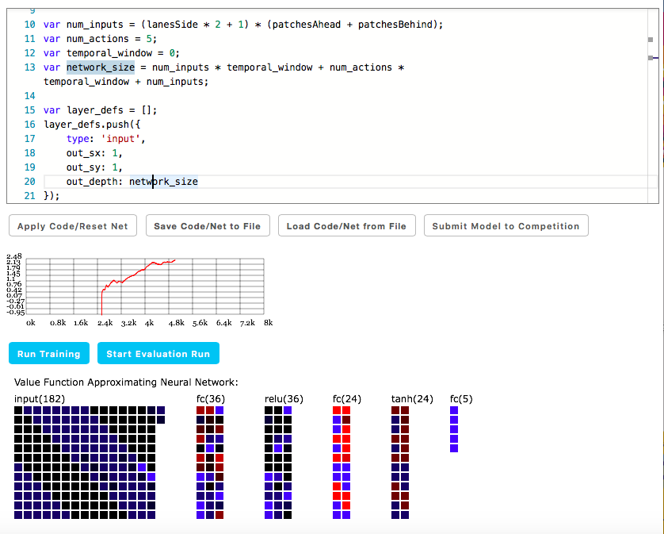
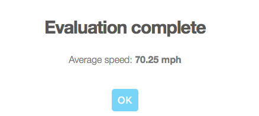

# DeepTraffic
## Based on the MIT platform

The MIT DeepTraffic platform provides users with a simply interface that
users can play with fairly easily. It helps people get familiarize with the
reinforcement technique fairly easily. 

When first loading the website of DeepTraffic, we can see that there are 
default codes that already have a decent structure of the model. 
This is a model of reinforcement learning. We have several parameters that are 
crucial to the model. 

I first changed the amount of lanes detected. I increased the lanesSide to 6 so
that more sides could be detected and the cars could move with more flexibilities.
The patchesAhead was increased to 12, and the patchesBehind was set to 2. The iterations
were 35000. Although the amount of training set was small, this was enough to train my model
because my laptop didn't perform too well.

I added two layers full-connected layers which had two different activation functions, 
one was relu, the other is tanh.
I don't have exact reasons why I chose these two funtions. It was for the sake of experiment only.

Apart from the functions, I changed the value of gamma. I set the gamma to 0.95, so that I could retain
the effect of the previous reward more. 
Epsilon value was also changed. Now I could have more explorations of the next step.

In the end, the result of my model was relatively good. The result was about 70mph. 